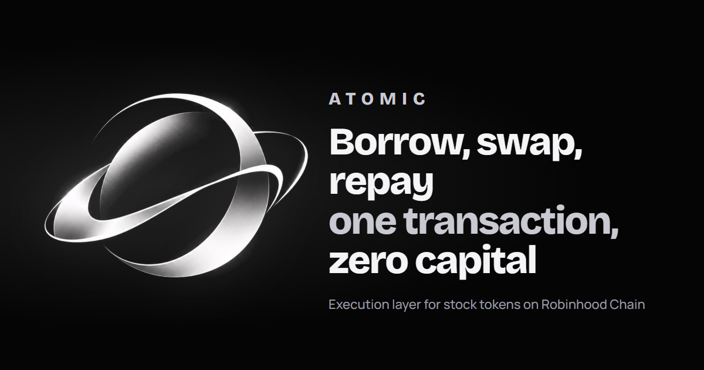
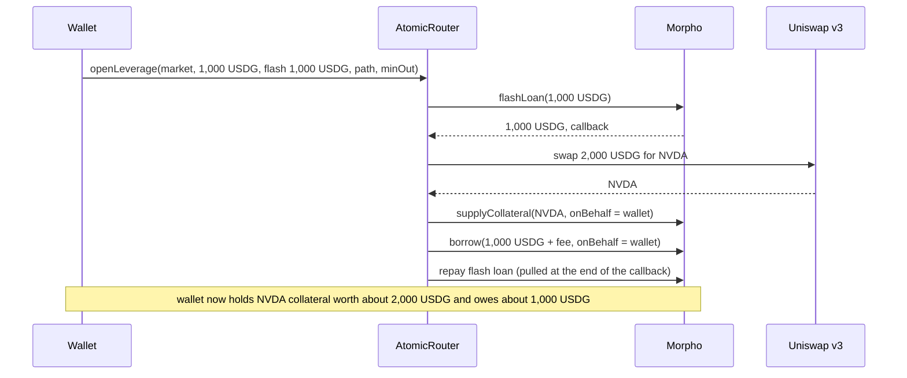

# ATOMIC



**Borrow, swap, repay in one transaction.**

ATOMIC is the execution layer for stock tokens on Robinhood Chain (chain id 4663). Stock tokens there are ordinary ERC-20s: Uniswap prices them, Morpho lends against them, Chainlink reports their price. ATOMIC composes those pieces into single transactions, so leverage, collateral rotation and arbitrage either settle completely or do not happen at all.

| | |
| --- | --- |
| App | https://useatomic.xyz/app |
| Site | https://useatomic.xyz |
| X | https://x.com/useatomic_xyz |
| Router v1.2 | [`0x82eec2769274eEc9F0BB9063F5B8a9908F3e389b`](https://sourcify.dev/#/lookup/0x82eec2769274eEc9F0BB9063F5B8a9908F3e389b) |
| Token | `0x658DC84c90A7286480Bb16d009Aa34606345f5fB` |

## Contents

- [Why it exists](#why-it-exists)
- [What it does](#what-it-does)
- [How one transaction works](#how-one-transaction-works)
- [The app](#the-app)
- [The router contract](#the-router-contract)
- [Fees and the holder waiver](#fees-and-the-holder-waiver)
- [Security](#security)
- [Deployed addresses](#deployed-addresses)
- [Repository layout](#repository-layout)
- [Run it locally](#run-it-locally)
- [Testing](#testing)
- [API](#api)
- [Risks](#risks)
- [FAQ](#faq)
- [License](#license)

## Why it exists

A fund with a prime broker can lever a stock, swap one position for another without sitting in cash, and take a price difference between two venues, all in seconds. Everyone else sells, waits for settlement, and buys again.

Once a stock is a token, none of that waiting is necessary. The liquidity to borrow is already sitting in lending markets, and the same stock already trades in several pools. What was missing is a way to run the steps together, so that no capital sits idle between them and no step can be left half done. That is the only thing ATOMIC sells: execution.

## What it does

| Action | What you get | What happens inside the transaction |
| --- | --- | --- |
| **Perpetual** | A leveraged long position on a stock with no expiry | Flash-borrow USDG, buy the stock, supply it as collateral, borrow against it, repay the flash loan |
| **Arbitrage** | The price difference between two pools, with zero capital | Flash-borrow USDG, buy in the cheaper pool, sell in the dearer one, repay, keep the rest |
| **Rotate** | The same loan, backed by a different stock | Flash-borrow the debt, repay and withdraw, swap the collateral, supply it, re-borrow, repay the flash loan |
| **Close** | Whatever is left after the loan is repaid, in USDG | Flash-borrow the debt, repay and withdraw, sell the collateral, repay the flash loan, return the remainder |

ATOMIC holds no deposits and runs no pool. Positions live on Morpho under the user's own address. The router only executes.

## How one transaction works

Opening a 2x position on NVDA with 1,000 USDG:



If the swap returns less than `minOut`, if Morpho refuses the borrow, or if anything else fails, the whole transaction reverts and the wallet is exactly where it started. The flash loan itself is free on Morpho.

## The app

A Next.js application at [useatomic.xyz/app](https://useatomic.xyz/app). Every number on it is read live from the chain.

| Tab | What it is for |
| --- | --- |
| **Perpetual** | Three questions (which stock, how much, how bold), a one-sentence summary and one button. A details section holds the what-if table, the equity chart, slippage and the step trace |
| **Borrow** | Put up stock tokens you already hold and borrow USDG against them, without selling. Direct Morpho calls from your wallet, no ATOMIC fee |
| **Arbitrage** | Every stock that trades in two or more pools across Uniswap v3, Uniswap v4, Ramses and giga, the gap between the cheapest and dearest pool, and the fees. Each gap that pays on paper is simulated as the real trade, and the button appears only when the simulation makes money |
| **Borrowers** | Every open loan on the stock markets: what each wallet holds and owes, live profit since entry, leverage and distance to liquidation |
| **Holders** | Status of the connected wallet, the full gap list, a liquidation watch and browser alerts, for wallets that hold ATOMIC |
| **My positions** | The connected wallet's positions with live profit, a one-transaction close, and repay-and-take-back for keeping the stock |
| **Rotate** | Move a position into another stock without touching the loan |

The first leveraged action from a wallet needs three signatures (approve USDG, authorize the router on Morpho, open). After that it is one.

## The arbitrage contract

[`contracts/src/AtomicArb.sol`](contracts/src/AtomicArb.sol) runs arbitrage across pools from different DEXes. It swaps directly against the pools instead of going through one DEX's router, so any pool that follows the Uniswap v3 swap interface works: Uniswap v3, Ramses v3 and giga (a PancakeSwap v3 style fork). Uniswap v4 pools are swapped through the v4 PoolManager.

```solidity
struct Hop { address pool; address tokenIn; address tokenOut; uint24 fee; int24 tickSpacing; address hooks; }

function arb(uint256 size, Hop[] calldata buy, Hop[] calldata sell, uint256 minProfit) external returns (uint256 profit);
```

- A hop whose `pool` is a v3 style pool only reads `pool` and `tokenIn`. A hop whose `pool` is the v4 PoolManager is a v4 swap, and the other four fields are the pool key.
- It flash-borrows `size` USDG from Morpho, runs it through `buy` into the stock and through `sell` back to USDG, repays, and sends the rest to the caller.
- It reverts with `InsufficientOutput(got, need)` when the round trip does not cover the loan, the fee and `minProfit`. A failed attempt costs gas and nothing else.
- It returns the profit, so an `eth_call` prices a trade exactly, price impact included. The app does this before it shows a button. A quoted gap means little when one pool is thin.
- It has no owner, no upgrade path and no state between transactions. The fee and the holder waiver are read from the router (`feeFor`, `treasury`), so there is one fee policy.
- A swap callback is accepted only from the pool being swapped against, only during that swap, and never for more than the amount sent into it.

Pools with a different callback (Algebra) and Uniswap v4 pools with a custom hook are shown in the app as watch only. The v4 pool keys in [`src/data/pools.json`](src/data/pools.json) are recovered by [`scripts/derive-v4-keys.mjs`](scripts/derive-v4-keys.mjs), which recomputes each pool id.

## The router contract

[`contracts/src/AtomicRouter.sol`](contracts/src/AtomicRouter.sol) is about 400 lines of Solidity 0.8.26 with no proxy, no upgrade path and no custody.

### Entry points

```solidity
function openLeverage(MarketParams calldata market, uint256 deposit, uint256 flashAmount, bytes calldata path, uint256 minCollateralOut) external;
function closePosition(MarketParams calldata market, bytes calldata path, uint256 minUsdgOut) external;
function rotate(MarketParams calldata from, MarketParams calldata to, bytes calldata path, uint256 minCollateralOut) external;
function arb(uint256 size, bytes calldata buyPath, bytes calldata sellPath, uint256 minProfit) external;
```

The router's own `arb` trades Uniswap v3 paths only. The app uses `AtomicArb` above for arbitrage.

`MarketParams` is Morpho's own struct (`loanToken`, `collateralToken`, `oracle`, `irm`, `lltv`). `path` is a packed Uniswap v3 path (`token, fee, token, ...`).

### Views

```solidity
function debtAssets(MarketParams calldata market, address user) external view returns (uint256);
function feeOn(uint256 flashAmount) public view returns (uint256);
function feeFor(address user, uint256 flashAmount) public view returns (uint256);
```

### Design rules

- **One callback, one context.** Every entry point records the caller and the action, then requests the flash loan. `onMorphoFlashLoan` accepts calls only from Morpho and only while an entry point is running.
- **Paths are checked end to end.** Length must be `20 + n * 23` bytes and the first and last tokens must match the recipe, so a crafted path cannot route a token that is not part of the action.
- **Only the caller's position.** Borrowing and withdrawing on Morpho use `msg.sender` as `onBehalf`. The router needs the caller's Morpho authorization and can never act on anyone else.
- **Nothing stays behind.** After every recipe the router's balance of every token involved is zero. A test asserts it.
- **Rounding follows Morpho.** Debt shares convert to assets rounding up, the same way Morpho does, so a full repay never leaves dust.

### Owner powers

The owner can change the fee (capped at 0.50%), the treasury, the holder waiver and ownership, and sweep tokens sent to the router by mistake. It cannot move, close or change any user position.

## Fees and the holder waiver

The router charges `feeBps` of the flash amount: 5 basis points (0.05%) today, hard-capped at 50. On a 1,000 USDG flash loan that is 0.50 USDG. Morpho's flash loan is free; pool fees and loan interest are separate and go to those protocols.

Wallets holding at least **100,000 ATOMIC** pay no router fee. There is no staking, lockup or claim: `feeFor` reads the wallet's balance at execution time.

```solidity
function feeFor(address user, uint256 flashAmount) public view returns (uint256) {
    if (holderToken != address(0) && holderToken.code.length > 0) {
        try IERC20(holderToken).balanceOf(user) returns (uint256 bal) {
            if (bal >= holderMin) return 0;
        } catch {}
    }
    return feeOn(flashAmount);
}
```

A token that reverts or has no code can never block an action: the normal fee simply applies.

## Security

- **Verified source.** v1.2 is an exact match on Sourcify.
- **41 fork tests** run against live mainnet state: router behaviour ([`AtomicRouter.t.sol`](contracts/test/AtomicRouter.t.sol), 13 tests), router adversarial cases ([`AtomicRouterAudit.t.sol`](contracts/test/AtomicRouterAudit.t.sol), 10 tests) and the arbitrage contract ([`AtomicArb.t.sol`](contracts/test/AtomicArb.t.sol), 18 tests against real Uniswap v3, Uniswap v4, Ramses and giga pools plus hostile fake pools).
- **Internal audit.** [`AUDIT.md`](AUDIT.md) lists every finding, the fix and the residual risks. It was written by the team that wrote the code. It is not a third-party audit.

| ID | Severity | Finding | Status |
| --- | --- | --- | --- |
| A1 | Medium | Swap paths were not validated | Fixed in v1.1 |
| A2 | Medium | Debt-free positions could not be closed or rotated | Fixed in v1.1 |
| A3 | Low | Callback did not require a running entry point | Fixed in v1.1 |
| A4 | Info | Router can only act on the caller's position | Verified by test |
| A5 | Low | Malformed paths were caught late | Fixed in v1.1 |
| A6 | Info | Router never holds funds after a recipe | Verified by test |
| A7 | Info | Owner powers are bounded | Verified by test |

Found something? Open an issue, or for anything exploitable reach the team on X first.

## Deployed addresses

Robinhood Chain, chain id 4663.

| Contract | Address |
| --- | --- |
| AtomicRouter v1.2 (live) | `0x82eec2769274eEc9F0BB9063F5B8a9908F3e389b` |
| AtomicArb v2 (live) | `0x4825A35C74Ffc5E6a6B60908136431F85F7A9fE7` |
| AtomicArb v1 (superseded) | `0xfc36D801680Ca99f4ebE020Ab9967f3249e87A48` |
| AtomicRouter v1.1 (superseded) | `0xC7056Fe38081b9359997FBCBf94591e2Cf7E34d9` |
| AtomicRouter v1.0 (superseded) | `0x7D0E0827a8Bbc5a2CD78e5B12226c65cB449a9Ec` |
| ATOMIC token | `0x658DC84c90A7286480Bb16d009Aa34606345f5fB` |
| Morpho | `0x9D53d5E3bd5E8d4Cbfa6DB1ca238AEA02E651010` |
| Uniswap v3 SwapRouter02 | `0xCaf681a66D020601342297493863E78C959E5cb2` |
| Uniswap v3 QuoterV2 | `0x33e885ed0ec9bf04ecfb19341582aadcb4c8a9e7` |
| Uniswap v3 Factory | `0x1f7d7550b1b028f7571e69a784071f0205fd2efa` |
| Uniswap v4 StateView | `0xf3334192d15450cdd385c8b70e03f9a6bd9e673b` |
| USDG | `0x5fc5360D0400a0Fd4f2af552ADD042D716F1d168` |
| WETH | `0x0Bd7D308f8E1639FAb988df18A8011f41EAcAD73` |
| Stock token factory | `0x4783C67b63dE2B358Ac5951a7D41F47A38F3C046` |

Superseded routers hold nothing. Version history is in [`contracts/deployment.json`](contracts/deployment.json).

## Repository layout

```
contracts/                 Foundry project
  src/AtomicRouter.sol     the router
  src/interfaces/          Morpho and SwapRouter02 interfaces
  script/Deploy.s.sol      deployment script
  test/                    fork tests (behaviour and adversarial)
src/app/                   Next.js app router
  page.tsx                 landing page
  app/                     the trading app (tabs via ?tab=)
  actions, how-it-works, markets, risks   content pages
  api/snapshot             prices, markets and liquidity in one cached multicall
  api/quote                best Uniswap v3 route for a swap
  api/borrowers            open loans with live profit
src/components/app/        one panel per tab, plus the transaction step runner
src/components/landing/    landing page sections
src/hooks/                 data hooks (snapshot, borrowers, on-chain reads)
src/lib/                   chain config, ABIs, leverage math, path encoding, arbitrage logic
src/data/                  generated snapshots: stock tokens, feeds, pools, markets
scripts/                   data refresh and social card renderers
AUDIT.md                   internal security review
```

## Run it locally

Requirements: Node 20 or newer, and Foundry for the contracts.

```bash
git clone https://github.com/atomic-xyz/atomic.git
cd atomic
npm install
cp .env.example .env
npm run dev
```

Open http://localhost:3000.

| Variable | Purpose |
| --- | --- |
| `NEXT_PUBLIC_ATOMIC_ROUTER` | Router the app signs against. Leave empty for simulation mode: every quote is live, nothing can be signed |
| `NEXT_PUBLIC_RPC_URLS` | Optional, comma separated. Replaces the default public RPC list |

Refresh the generated data (stock list, Chainlink feeds, pools, Morpho markets):

```bash
node scripts/pull-data.mjs
```

Production build:

```bash
npm run build
npm run start
```

## Testing

```bash
cd contracts
forge install foundry-rs/forge-std
forge test
```

Tests fork Robinhood Chain through `RPC_URL` (default `https://robinhood.drpc.org`). `foundry.toml` sets `evm_version = "cancun"` because the stock tokens use opcodes that older targets reject.

Because they run against the real chain, a test can fail when a market's state changes. Rotation tests target the GOOGL market for that reason: the AAPL market was fully borrowed in October 2026.

Deploying your own router:

```bash
cd contracts
cp .env.example .env    # fill in PRIVATE_KEY and TREASURY
forge create src/AtomicRouter.sol:AtomicRouter --rpc-url $RPC_URL --private-key $PRIVATE_KEY --legacy --broadcast \
  --constructor-args 0x9D53d5E3bd5E8d4Cbfa6DB1ca238AEA02E651010 0xCaf681a66D020601342297493863E78C959E5cb2 0x5fc5360D0400a0Fd4f2af552ADD042D716F1d168 $TREASURY 5
```

## API

The app's own read endpoints. They are public and cached.

### `GET /api/snapshot`

One multicall, refreshed every 8 seconds and served stale while revalidating.

```jsonc
{
  "at": 1790000000000,          // unix ms
  "block": 79092572,
  "ethUsd": 2687.1,
  "usdgUsd": 1.0,
  "feeds":   { "NVDA": { "symbol": "NVDA", "price": 235.1 } },   // Chainlink
  "venues":  [ { "symbol": "NVDA", "dex": "uniswap-v3-robinhood", "quote": "USDG", "fee": 500, "price": 235.3, "deviation": 0.0008, "tvl": 5770000, "vol24": 16760000 } ],
  "markets": [ { "id": "0x8b16…", "symbol": "NVDA", "lltv": 0.625, "supplyUSDG": 623355, "borrowUSDG": 613930, "borrowApy": 0.0041, "oraclePrice": 235.2 } ],
  "flashLiquidityUSDG": 60886852
}
```

Pools with no in-range liquidity, or priced more than 50% away from Chainlink, are dropped as broken.

### `GET /api/quote?tokenIn=&tokenOut=&amountIn=`

Tries every Uniswap v3 fee tier, plus two-hop routes through WETH and USDG, and returns the best.

### `GET /api/borrowers`

Every open loan on the stock markets, from Morpho's indexer, with profit since entry.

```jsonc
{
  "count": 39,
  "totalBorrowUsd": 1456137,
  "totalCollateralUsd": 3641658,
  "totalPnlUsd": 107376,
  "borrowers": [
    { "address": "0x…", "symbol": "NVDA", "collateralUsd": 1621.0, "borrowUsd": 889.9, "equityUsd": 731.1,
      "leverage": 2.22, "dropToLiquidation": 0.125, "pnlUsd": 30.47, "pnlPct": 0.043, "entryPrice": 220.68 }
  ]
}
```

Profit is `collateral value now - loan now - net cash in`. Net cash in is rebuilt from the wallet's own Morpho transactions, with each collateral deposit valued at the hourly price when it happened.

## Risks

- **Liquidation.** A leveraged position is closed by Morpho if the stock falls far enough. At 2x that is roughly a 20% drop. The app shows the exact price before you sign.
- **Long only.** There is no short side.
- **Leverage ceiling.** Markets lend up to 62.5% of collateral value today, which caps leverage near 2.3x.
- **Market liquidity.** A market can run out of USDG to borrow. The app says so before you sign.
- **Smart contract risk.** The router, Morpho and Uniswap are all code. The router has been reviewed internally, not by a third party.
- **Arbitrage is competitive.** Gaps close in seconds. A transaction that arrives too late reverts and costs gas.

## FAQ

**Is this a perpetual futures exchange?**
No. "Perpetual" here means a leveraged spot position with no expiry, financed by a loan. There are no funding payments and no shorts.

**Where does my position live?**
On Morpho, under your own address. You can manage or close it without ATOMIC.

**Do I need capital for arbitrage?**
Only ETH for gas. The USDG is borrowed and repaid inside the transaction.

**What happens if a step fails?**
The whole transaction reverts. You pay gas and nothing else changes.

**Which pools can the router trade?**
Uniswap v3. Gaps on other pool types are shown as watch-only.

**Can the team take my funds?**
The router never holds user funds, and the owner has no function that touches positions.

## License

MIT, see [`LICENSE`](LICENSE).
